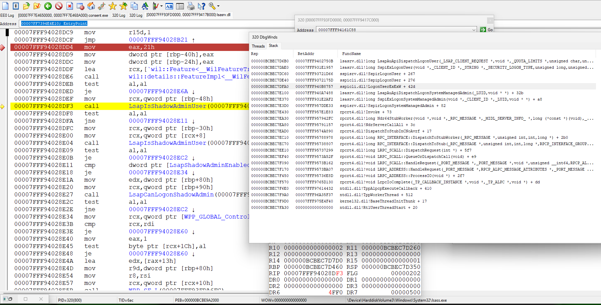

# ShadowAdmin

based on https://specterops.io/blog/2025/06/18/administrator-protection/

samlib.dll (client dll to samsrv.dll) now export 2 new API

```
EXTERN_C_START

NTSYSCALLAPI
NTSTATUS
NTAPI
SamiFindOrCreateShadowAdminAccount(_In_ PSID UserSid, _Out_ PWSTR* AdminName, _Out_ PSID ShadowSid);

NTSYSCALLAPI
NTSTATUS
NTAPI
SamiIsShadowAdminAccount(_In_ PSID ShadowSid, _Out_ PBOOLEAN pbShadow, _Out_ PWSTR* AdminName, _Out_ PSID UserSid);

EXTERN_C_END
```

( AdminName, and UserSid on return , need free with SamFreeMemory api)

demo usage is 

```
EXTERN_C_START

PVOID __imp_SamiIsShadowAdminAccount = 0, __imp_SamiFindOrCreateShadowAdminAccount = 0;

EXTERN_C_END

#define GetApi(hmod, name) (__imp_##name = GetProcAddress(hmod, #name))

void TestNewApi(PSID UserSid)
{
	PSID ShadowSid;
	PWSTR AdminName;
	BOOLEAN bShadow;
	NTSTATUS status = SamiFindOrCreateShadowAdminAccount(UserSid, &AdminName, &ShadowSid);
	if (0 <= status)
	{
		DbgPrint("AdminName=\"%ws\"\n", AdminName);
		SamFreeMemory(AdminName);
		status = SamiIsShadowAdminAccount(ShadowSid, &bShadow, &AdminName, &UserSid);
		SamFreeMemory(ShadowSid);
		if (0 <= status && bShadow)
		{
			DbgPrint("AdminName=\"%ws\"\n", AdminName);
			SamFreeMemory(AdminName);
			SamFreeMemory(UserSid);
		}
	}
}

BOOLEAN IsShadowAdminApiPresent()
{
	if (HMODULE hmod = GetModuleHandleW(L"samlib.dll"))
	{
		if (GetApi(hmod, SamiFindOrCreateShadowAdminAccount) && GetApi(hmod, SamiIsShadowAdminAccount))
		{
			return TRUE;
		}
	}

	return FALSE;
}
```

## Enum Shadow Admins

we can enum all Shadow Admins (name, sid and Linked User Sid) with next code:

```
NTSTATUS EnumShadowAdmins()
{
	SAM_HANDLE ServerHandle, DomainHandle, AliasHandle;
	OBJECT_ATTRIBUTES oa = { sizeof(oa) };
	NTSTATUS status = SamConnect(0, &ServerHandle, SAM_SERVER_LOOKUP_DOMAIN, &oa);
	if (0 <= status)
	{
		SID BUILTIN = { SID_REVISION, 1, SECURITY_NT_AUTHORITY, {SECURITY_BUILTIN_DOMAIN_RID } };

		status = SamOpenDomain(ServerHandle, DOMAIN_EXECUTE|DOMAIN_READ, &BUILTIN, &DomainHandle);
		SamCloseHandle(ServerHandle);
		if (0 <= status)
		{
			status = SamOpenAlias(DomainHandle, ALIAS_LIST_MEMBERS, DOMAIN_ALIAS_RID_ADMINS, &AliasHandle);
			SamCloseHandle(DomainHandle);
			if (0 <= status)
			{
				ULONG MemberCount;
				PSID *MemberIds, UserSid, Sid;
				status = SamGetMembersInAlias(AliasHandle, &MemberIds, &MemberCount);
				SamCloseHandle(AliasHandle);
				if (0 <= status)
				{
					PVOID buf = MemberIds;
					if (MemberCount)
					{
						do 
						{
							BOOLEAN bShadowAdmin;
							PWSTR Name;
							if (0 <= (status = SamiIsShadowAdminAccount(Sid = *MemberIds++, &bShadowAdmin, &Name, &UserSid)))
							{
								if (bShadowAdmin)
								{
									WCHAR sz1[SECURITY_MAX_SID_STRING_CHARACTERS], sz2[SECURITY_MAX_SID_STRING_CHARACTERS];
									UNICODE_STRING us1 = { 0, sizeof(sz1), sz1 }, us2 = { 0, sizeof(sz2), sz2 };
									RtlConvertSidToUnicodeString(&us1, Sid, FALSE);
									RtlConvertSidToUnicodeString(&us2, UserSid, FALSE);
									DbgPrint("%ws: %wZ -> %wZ\n", Name, &us1, &us2);
									SamFreeMemory(UserSid);
									SamFreeMemory(Name);
								}
							}
						} while (--MemberCount);
					}
					SamFreeMemory(buf);
				}
			}
		}
	}
	return status;
}
```

## How Do Users Get a Shadow Account Token?

consent.exe call
```
ULONG CuipGetElevatedToken(_Out_ PHANDLE phToken);
```

which internal simply call `NtQueryInformationToken` with `TokenLinkedToken`

during this call, in kernel called `SepLogonSystemManagedAdmin` (in `ntoskrnl.exe`) and it call `KsecLogonSystemManagedAdmin` in `ksecdd.sys`
it do RPC (via ALPC) call to lsass.exe - `SspirLogonSystemManagedAdmin` (in `SspiSrv.dll` )


```
NTSTATUS SspiExLogonSystemManagedAdmin(_In_ PLSA_CLIENT_REQUEST ClientRequest, _In_ PCLIENT_ID cid, _In_ LUID Luid, _Out_ PHANDLE phToken);
```

this function call 

```
NTSTATUS LsapAuApiDispatchLogonSystemManagedAdmin( _In_ LUID Luid, _Out_ PHANDLE phToken);
```

inside lsasrv.dll

and here called `SamiFindOrCreateShadowAdminAccount(,&AdminName, )` and `LogonUserExExW(AdminName, L".", L"", ...)`

( user Sid is taken from token associated with Luid )

if user logon ( by auth package) is ok, lsasrv call `LsapIsShadowAdminUser` (exist 2 variants of this api, which take user SID or name)
and if yes, `LsapCanLogonShadowAdmin` called, which check some conditions, in particular `LsapIsProcessOnShadowAdminAllowList`
this function check that caller process name is consent.exe or lsass.exe ( in our concrete case, this is lsass.exe )



really this is very weak check, because no problem exec by self new consent.exe or lsass.exe and inject to it self code, which call `LogonUserExExW` or `LsaLogonUser`

as demo, SAU project - start consent.exe, inject to it own dll and call LsaLogonUser, if found Shadow admin account. it token get - then start cmd and in it whoami

of course we need from begin have elevated admin or local system token. so this is not privilege escalation - we already have all at begin. this is only show that no sense check caller process name

run [demo.bat](https://github.com/rbmm/ShadowAdmin/blob/main/x64/Release/demo.bat) for test

the complete trace of [SspiExLogonSystemManagedAdmin](https://github.com/rbmm/TVI/blob/main/DEMO/SspirLogonSystemManagedAdmin.tvi)
it can be looked with [tvi.exe](https://github.com/rbmm/TVI/blob/main/X64/tvi.exe) tool


## Legacy Shadow Admin implementation ( 26100.1742 )

look implementation of basic consent.exe functions in [LegacyShadowAdminAccount.cpp](LegacyShadowAdminAccount.cpp)

`CuiGetTokenForApp` is called. inside it called `GetCredentials` ( it use `CredUIPromptForWindowsCredentialsW` ) and then `AttemptLogon` -> `AttemptCredProvLogon` (used data returned by `CredUIPromptForWindowsCredentialsW` )
of course, if user not admin or UAC set for ask admin for credentials too otherwise simply existing admin token is used and `CredUIPromptForWindowsCredentialsW` show only Yes/No dialog 

then, if settings set to use ShadowAdmin, function `CuipCreateAutomaticAdminAccount` is called

but this function always fail ! how it work ?
first it get user name from token, via `ImpersonateLoggedOnUser/GetUserNameExW(NameSamCompatible)/RevertToSelf`

than `CuipGetShadowAdminAccountSuffix` is called. it add `_????????` ( _ and 8 random chars from `"abcdefghijklmnopqrstuvwxyz0123456789"` set ) suffix to name.
which chars is add depend from user Sid sha256 hash

say for examply user name is `Kelly` and shadow admin name can be `Kelly_atunm63m`

than was check via `NetUserGetInfo`, are such user exist. if not - `NetUserAdd` is called, for create new user. and this call always fail.
`USER_INFO_4` is used and problem in `usri4_flags`. consent set it to

```
UF_DONT_EXPIRE_PASSWD|UF_SHADOW_ADMIN_ACCOUNT|UF_PASSWD_CANT_CHANGE|UF_PASSWD_NOTREQD|UF_SCRIPT;
```

where 

```
#define UF_SHADOW_ADMIN_ACCOUNT         0x4000
```


is undocumented flag. but NetUserAdd dont recognize it ))


so api fail with `ERROR_INVALID_PARAMETER` (and `if (parm_err) *parm_err = 8;` despite usri4_flags is 7 , not 8 )

but in new versions of SAMCLI.DLL ( where `NetUserAdd` is implemented ) this is fixed:


if `Feature_ShadowAdmin__private_IsEnabledDeviceUsageNoInline` flag `UF_SHADOW_ADMIN_ACCOUNT` (0x4000) became valid

but let we fix (under debugger) `UF_SHADOW_ADMIN_ACCOUNT` flag. account will be created. but this is not all.

`CuipHideShadowAdminFromLogonUi` set `UserDontShowInLogonUI` property on account and `NetLocalGroupAddMembers` add it to `"Administrators"`
`LogonUserExExW` then is called (it ok). but then..
`CreateShadowAdminLink` is called. it use strange `(TOKEN_INFORMATION_CLASS)-2` value. and got error `STATUS_NOT_IMPLEMENTED`
interesting that kernel implementation of `NtSetInformationToken` first check `TOKEN_INFORMATION_CLASS` as unsigned and reject `-2` as too big.
and return `STATUS_NOT_IMPLEMENTED`. but if skip this check, then value for `-2` is checked (despite this code is unreachable). and in this case,
`SepOneWayLinkLogonSessions` api is called. but it have very simply implementation - 
```
NTSTATUS SepOneWayLinkLogonSessions()
{
    return STATUS_NOT_SUPPORTED;
} 
```


so at first `NetUserAdd` dont work with `UF_SHADOW_ADMIN_ACCOUNT`, then `NtSetInformationToken` wrong check for `-2`, and finally, 
even if check was correct, `SepOneWayLinkLogonSessions` anyway return `STATUS_NOT_SUPPORTED`

so `CreateShadowAdminLink` always fail too. so i be say, that in version 26100.1742 this never work, despite some code exist

## Current Shadow Admin implementation ( 27858.1000 )