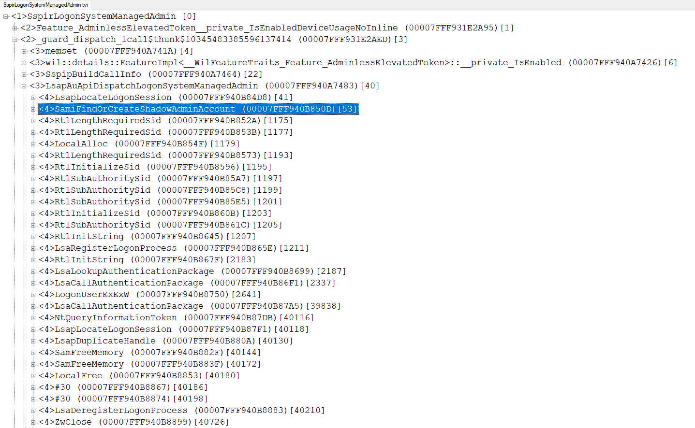
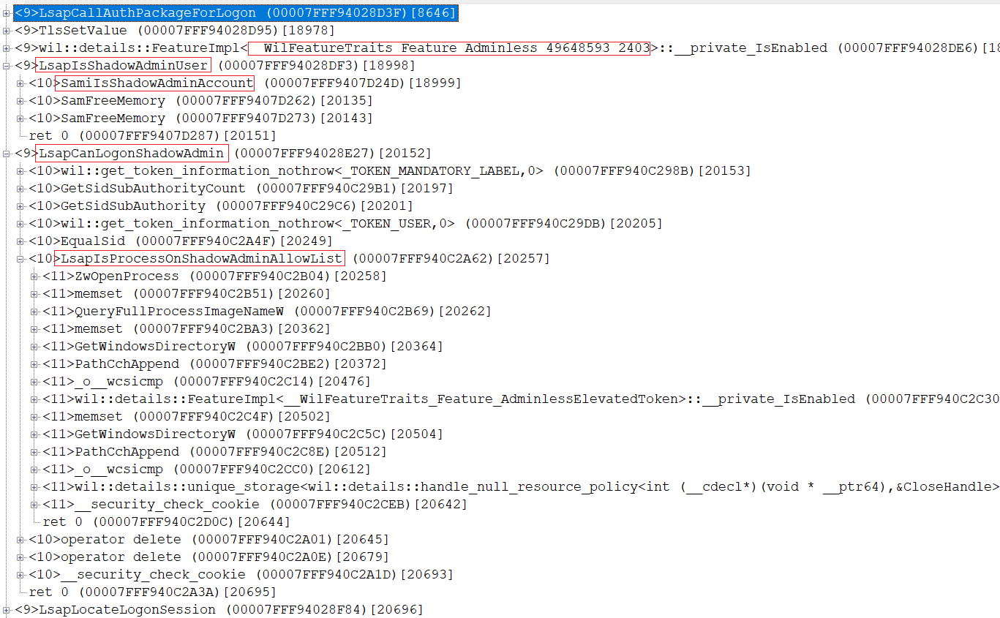
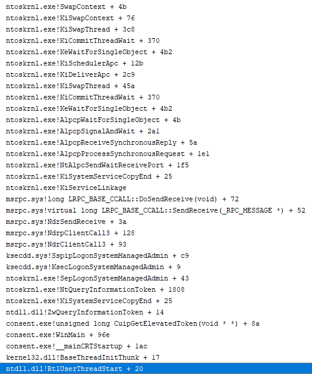
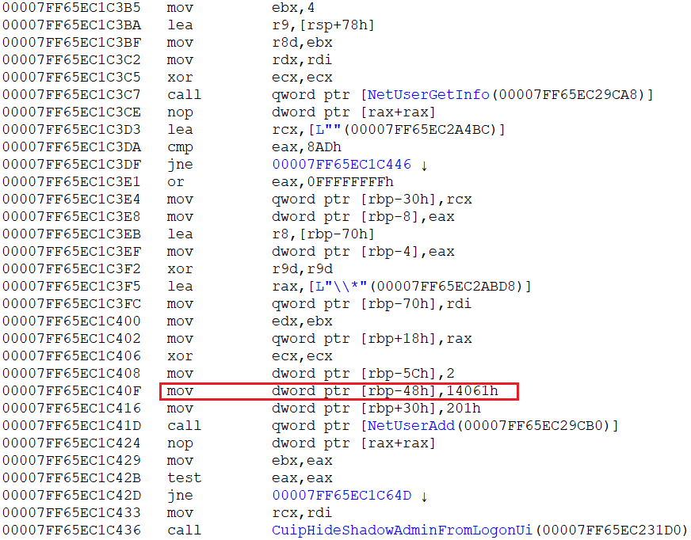
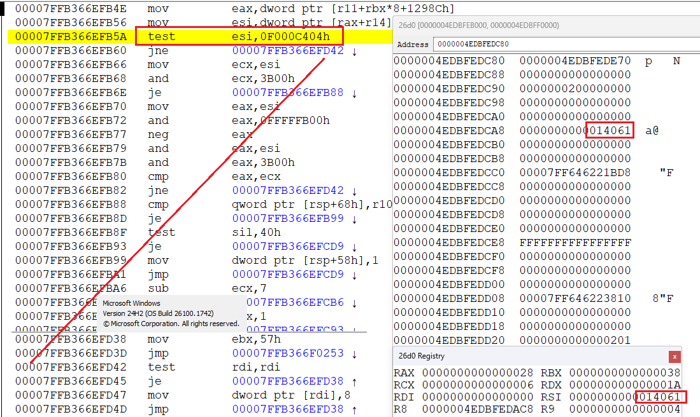
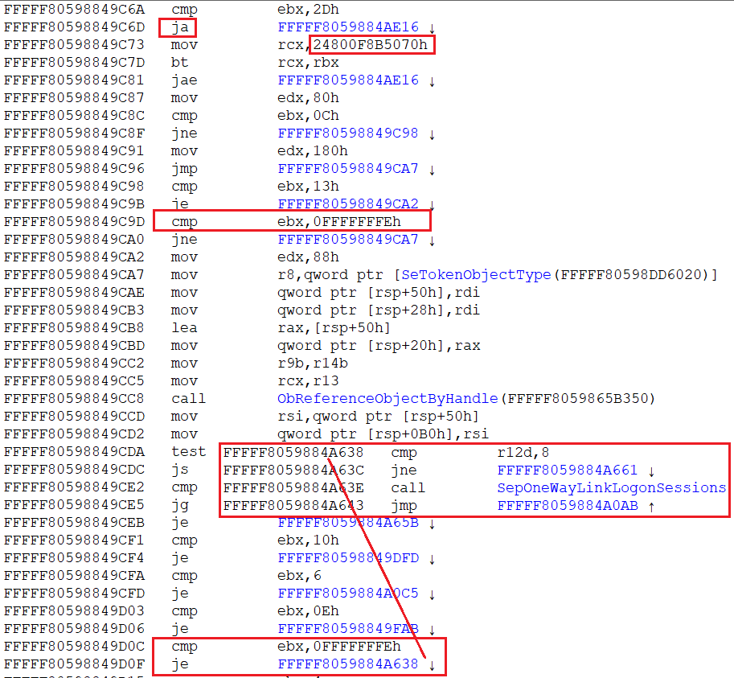
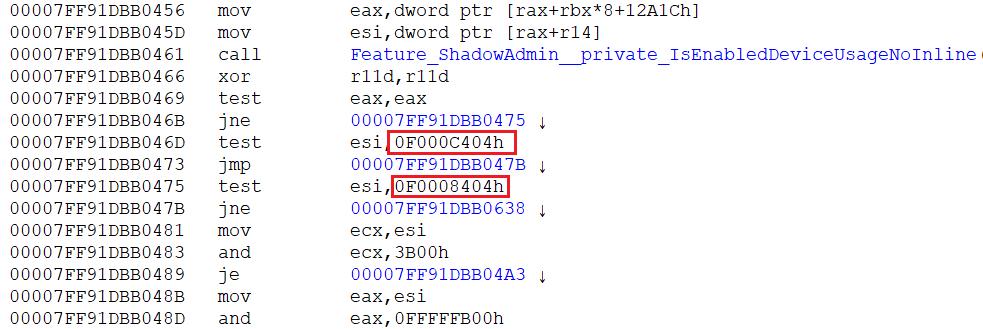

# ShadowAdmin

based on https://specterops.io/blog/2025/06/18/administrator-protection/

## New Api

samlib.dll (client dll to samsrv.dll) now export 2 new API

```
EXTERN_C_START

NTSYSCALLAPI
NTSTATUS
NTAPI
SamiFindOrCreateShadowAdminAccount(_In_ PSID UserSid, _Out_ PWSTR* AdminName, _Out_ PSID ShadowSid);

NTSYSCALLAPI
NTSTATUS
NTAPI
SamiIsShadowAdminAccount(_In_ PSID ShadowSid, _Out_ PBOOLEAN pbShadow, _Out_ PWSTR* AdminName, _Out_ PSID UserSid);

EXTERN_C_END
```

( AdminName, and UserSid on return, need free with `SamFreeMemory` api)

demo usage is 

```
EXTERN_C_START

PVOID __imp_SamiIsShadowAdminAccount = 0, __imp_SamiFindOrCreateShadowAdminAccount = 0;

EXTERN_C_END

#define GetApi(hmod, name) (__imp_##name = GetProcAddress(hmod, #name))

void TestNewApi(PSID UserSid)
{
	PSID ShadowSid;
	PWSTR AdminName;
	BOOLEAN bShadow;
	NTSTATUS status = SamiFindOrCreateShadowAdminAccount(UserSid, &AdminName, &ShadowSid);
	if (0 <= status)
	{
		DbgPrint("AdminName=\"%ws\"\n", AdminName);
		SamFreeMemory(AdminName);
		status = SamiIsShadowAdminAccount(ShadowSid, &bShadow, &AdminName, &UserSid);
		SamFreeMemory(ShadowSid);
		if (0 <= status && bShadow)
		{
			DbgPrint("AdminName=\"%ws\"\n", AdminName);
			SamFreeMemory(AdminName);
			SamFreeMemory(UserSid);
		}
	}
}

BOOLEAN IsShadowAdminApiPresent()
{
	if (HMODULE hmod = GetModuleHandleW(L"samlib.dll"))
	{
		if (GetApi(hmod, SamiFindOrCreateShadowAdminAccount) && GetApi(hmod, SamiIsShadowAdminAccount))
		{
			return TRUE;
		}
	}

	return FALSE;
}
```

## Enum Shadow Admins

we can enum all Shadow Admins (Name, Sid and Linked User Sid) with next code:

```
NTSTATUS EnumShadowAdmins()
{
	SAM_HANDLE ServerHandle, DomainHandle, AliasHandle;
	OBJECT_ATTRIBUTES oa = { sizeof(oa) };
	NTSTATUS status = SamConnect(0, &ServerHandle, SAM_SERVER_LOOKUP_DOMAIN, &oa);
	if (0 <= status)
	{
		SID BUILTIN = { SID_REVISION, 1, SECURITY_NT_AUTHORITY, {SECURITY_BUILTIN_DOMAIN_RID } };

		status = SamOpenDomain(ServerHandle, DOMAIN_EXECUTE|DOMAIN_READ, &BUILTIN, &DomainHandle);
		SamCloseHandle(ServerHandle);
		if (0 <= status)
		{
			status = SamOpenAlias(DomainHandle, ALIAS_LIST_MEMBERS, DOMAIN_ALIAS_RID_ADMINS, &AliasHandle);
			SamCloseHandle(DomainHandle);
			if (0 <= status)
			{
				ULONG MemberCount;
				PSID *MemberIds, UserSid, Sid;
				status = SamGetMembersInAlias(AliasHandle, &MemberIds, &MemberCount);
				SamCloseHandle(AliasHandle);
				if (0 <= status)
				{
					PVOID buf = MemberIds;
					if (MemberCount)
					{
						do 
						{
							BOOLEAN bShadowAdmin;
							PWSTR Name;
							if (0 <= (status = SamiIsShadowAdminAccount(Sid = *MemberIds++, &bShadowAdmin, &Name, &UserSid)))
							{
								if (bShadowAdmin)
								{
									WCHAR sz1[SECURITY_MAX_SID_STRING_CHARACTERS], sz2[SECURITY_MAX_SID_STRING_CHARACTERS];
									UNICODE_STRING us1 = { 0, sizeof(sz1), sz1 }, us2 = { 0, sizeof(sz2), sz2 };
									RtlConvertSidToUnicodeString(&us1, Sid, FALSE);
									RtlConvertSidToUnicodeString(&us2, UserSid, FALSE);
									DbgPrint("%ws: %wZ -> %wZ\n", Name, &us1, &us2);
									SamFreeMemory(UserSid);
									SamFreeMemory(Name);
								}
							}
						} while (--MemberCount);
					}
					SamFreeMemory(buf);
				}
			}
		}
	}
	return status;
}
```

## How Shadow Account Created ?

by direct call `SamiFindOrCreateShadowAdminAccount` or .. by call `NtQueryInformationToken` with `TokenLinkedToken` on admin user. let look on call stack

```
ntoskrnl.exe!SwapContext + 4b
ntoskrnl.exe!KiSwapContext + 76
ntoskrnl.exe!KiSwapThread + 3c8
ntoskrnl.exe!KiCommitThreadWait + 370
ntoskrnl.exe!KeWaitForSingleObject + 4b2
ntoskrnl.exe!KiSchedulerApc + 12b
ntoskrnl.exe!KiDeliverApc + 2c9
ntoskrnl.exe!KiSwapThread + 45a
ntoskrnl.exe!KiCommitThreadWait + 370
ntoskrnl.exe!KeWaitForSingleObject + 4b2
ntoskrnl.exe!AlpcpWaitForSingleObject + 4b
ntoskrnl.exe!AlpcpSignalAndWait + 2a1
ntoskrnl.exe!AlpcpReceiveSynchronousReply + 5a
ntoskrnl.exe!AlpcpProcessSynchronousRequest + 1e1
ntoskrnl.exe!NtAlpcSendWaitReceivePort + 1f5
ntoskrnl.exe!KiSystemServiceCopyEnd + 25
ntoskrnl.exe!KiServiceLinkage
msrpc.sys!long LRPC_BASE_CCALL::DoSendReceive(void) + 72
msrpc.sys!virtual long LRPC_BASE_CCALL::SendReceive(_RPC_MESSAGE *) + 52
msrpc.sys!NdrSendReceive + 3a
msrpc.sys!NdrpClientCall3 + 128
msrpc.sys!NdrClientCall3 + 93
ksecdd.sys!SspipLogonSystemManagedAdmin + c9
ksecdd.sys!KsecLogonSystemManagedAdmin + 9
ntoskrnl.exe!SepLogonSystemManagedAdmin + 43
ntoskrnl.exe!NtQueryInformationToken + 1808
ntoskrnl.exe!KiSystemServiceCopyEnd + 25
ntdll.dll!ZwQueryInformationToken + 14
consent.exe!unsigned long CuipGetElevatedToken(void * *) + 8a
consent.exe!WinMain + 96e
consent.exe!__mainCRTStartup + 1ac
kernel32.dll!BaseThreadInitThunk + 17
ntdll.dll!RtlUserThreadStart + 20
```

so from kernel called `SepLogonSystemManagedAdmin` which call `KsecLogonSystemManagedAdmin` -> `SspipLogonSystemManagedAdmin` from ksecdd.sys
this make ALPC call to lsass. let look for stack in lsass now

```
ntdll.dll!ZwAlpcSendWaitReceivePort + 14
rpcrt4.dll!long LRPC_BASE_CCALL::DoSendReceive(void) + 152
rpcrt4.dll!virtual long LRPC_CCALL::SendReceive(_RPC_MESSAGE *) + 76
rpcrt4.dll!NdrSendReceive + 71
rpcrt4.dll!NdrpClientCall3 + 744
rpcrt4.dll!NdrClientCall3 + ed
samlib.dll!SamiFindOrCreateShadowAdminAccount + bd
lsasrv.dll!long LsapAuApiDispatchLogonSystemManagedAdmin(_LUID,void * *) + e8
lsasrv.dll!long SspiExLogonSystemManagedAdmin(void *,_CLIENT_ID *,_LUID,void * *) + a8
sspisrv.dll!SspirLogonSystemManagedAdmin + 82
rpcrt4.dll!Invoke + 73
rpcrt4.dll!long Ndr64StubWorker(void *,void *,_RPC_MESSAGE *,_MIDL_SERVER_INFO_ *,long (*const *)(void),_MIDL_SYNTAX_INFO *,unsigned long *) + 4e3
rpcrt4.dll!NdrServerCallAll + 3c
rpcrt4.dll!DispatchToStubInCNoAvrf + 17
rpcrt4.dll!long RPC_INTERFACE::DispatchToStubWorker(_RPC_MESSAGE *,unsigned int,int,long *) + 2b0
rpcrt4.dll!long RPC_INTERFACE::DispatchToStub(_RPC_MESSAGE *,unsigned int,int,long *,RPCP_INTERFACE_GROUP *) + 198
rpcrt4.dll!long LRPC_SCALL::DispatchRequest(int *) + 5f7
rpcrt4.dll!void LRPC_SCALL::QueueOrDispatchCall(void) + e9
rpcrt4.dll!void LRPC_SCALL::HandleRequest(_PORT_MESSAGE *,_PORT_MESSAGE *,void *,unsigned __int64,RPCP_ALPC_HANDLE_ATTR *) + 2af
rpcrt4.dll!void LRPC_ADDRESS::HandleRequest(_PORT_MESSAGE *,RPCP_ALPC_MESSAGE_ATTRIBUTES *,_PORT_MESSAGE *,int) + 3a2
rpcrt4.dll!void LRPC_ADDRESS::ProcessIO(void *) + 2f7
rpcrt4.dll!void LrpcIoComplete(_TP_CALLBACK_INSTANCE *,void *,_TP_ALPC *,void *) + dd
ntdll.dll!TppAlpcpExecuteCallback + 410
ntdll.dll!TppWorkerThread + 512
kernel32.dll!BaseThreadInitThunk + 17
ntdll.dll!RtlUserThreadStart + 20
```

the `SspirLogonSystemManagedAdmin` called from `sspisrv.dll` which call 

```
NTSTATUS SspiExLogonSystemManagedAdmin(
	_In_ PLSA_CLIENT_REQUEST ClientRequest, 
	_In_ PCLIENT_ID cid, 
	_In_ LUID Luid, 
	_Out_ PHANDLE phToken);
```

inside lsasrv.dll

and it call

```
NTSTATUS LsapAuApiDispatchLogonSystemManagedAdmin( _In_ LUID Luid, _Out_ PHANDLE phToken);	
```

and inside it `SamiFindOrCreateShadowAdminAccount(Sid, &AdminName, )` already called, and then `LogonUserExExW(AdminName, L".", L"", ...)`

( user Sid is taken from token associated with Luid )

`SamiFindOrCreateShadowAdminAccount` again do ALPC call, so let look for this serverthread stack

```
samsrv.dll!ShadowAdminAccount::ShadowAdminAccount(void) + 7
samsrv.dll!long SAAManager::LookupOrCreateShadowAdminAccount(void *,ShadowAdminAccount * *) + 3b
samsrv.dll!long SampFindOrCreateShadowAdminAccount(void *,unsigned short * *,void * *) + 15b
samsrv.dll!SamrFindOrCreateShadowAdminAccount + 10f
rpcrt4.dll!Invoke + 73
rpcrt4.dll!long Ndr64StubWorker(void *,void *,_RPC_MESSAGE *,_MIDL_SERVER_INFO_ *,long (*const *)(void),_MIDL_SYNTAX_INFO *,unsigned long *) + 4e3
rpcrt4.dll!NdrServerCallAll + 3c
rpcrt4.dll!DispatchToStubInCNoAvrf + 17
rpcrt4.dll!long RPC_INTERFACE::DispatchToStubWorker(_RPC_MESSAGE *,unsigned int,int,long *) + 2b0
rpcrt4.dll!long RPC_INTERFACE::DispatchToStub(_RPC_MESSAGE *,unsigned int,int,long *,RPCP_INTERFACE_GROUP *) + 198
rpcrt4.dll!long LRPC_SCALL::DispatchRequest(int *) + 5f7
rpcrt4.dll!void LRPC_SCALL::QueueOrDispatchCall(void) + e9
rpcrt4.dll!void LRPC_SCALL::HandleRequest(_PORT_MESSAGE *,_PORT_MESSAGE *,void *,unsigned __int64,RPCP_ALPC_HANDLE_ATTR *) + 2af
rpcrt4.dll!void LRPC_ADDRESS::HandleRequest(_PORT_MESSAGE *,RPCP_ALPC_MESSAGE_ATTRIBUTES *,_PORT_MESSAGE *,int) + 3a2
rpcrt4.dll!void LRPC_ADDRESS::ProcessIO(void *) + 2f7
rpcrt4.dll!void LrpcIoComplete(_TP_CALLBACK_INSTANCE *,void *,_TP_ALPC *,void *) + dd
ntdll.dll!TppAlpcpExecuteCallback + 410
ntdll.dll!TppWorkerThread + 512
kernel32.dll!BaseThreadInitThunk + 17
ntdll.dll!RtlUserThreadStart + 20
```

`SamrFindOrCreateShadowAdminAccount` is called inside `samsrv.dll`

so call to `NtQueryInformationToken` with `TokenLinkedToken` lead finally to this...

the `SamrFindOrCreateShadowAdminAccount` find or create shadow admin account for admin user.
and `LogonUserExExW` create token for this shadow admin, which returned as `TokenLinkedToken`

the complete trace of [SspiExLogonSystemManagedAdmin](https://github.com/rbmm/TVI/blob/main/DEMO/SspirLogonSystemManagedAdmin.tvi)
it can be looked with [tvi.exe](https://github.com/rbmm/TVI/blob/main/X64/tvi.exe) tool



let now look for `LogonUserExExW` in more details. after `LsapCallAuthPackageForLogon` success, new code is added



(look [postlogon.cpp](postlogon.cpp) for full code )

```
	PCWSTR username;	// user Name
	PSID Sid;			// user Sid
	HANDLE hToken;		// of process which call LsaLogonUser
	ULONG dwProcessId;	// of process which call LsaLogonUser

	if (LsapIsShadowAdminUser(username) || LsapIsShadowAdminUser(Sid))
	{
		if (!LsapShadowAdminEnabled || LsapCanLogonShadowAdmin(hToken, dwProcessId)) 
		{
			return STATUS_ACCESS_DENIED;
		}
	}
```

so:
1) checked are user is shadow admin by Sid and name (for Legacy Shadow Admin)
2) if `LsapShadowAdminEnabled` (global variable) or `LsapCanLogonShadowAdmin` return false, `STATUS_ACCESS_DENIED` returned

`LsapCanLogonShadowAdmin` by self first check caller (of `LsaLogonUser`) token integrity, it must be >= `SECURITY_MANDATORY_SYSTEM_RID`
then checked `TokenUser` sid - it must be `S-1-5-18` (`NT AUTHORITY\SYSTEM` - `WellKnownGroup`)
and finally `LsapIsProcessOnShadowAdminAllowList` called - it checked FullProcessImageName - compare it with `%windir%\System32\Consent.exe`
and `%windir%\System32\Lsass.exe`( in our concrete case, this is lsass.exe )

really this is very weak check, because no problem exec by self new consent.exe or lsass.exe and inject to it self code, which call `LogonUserExExW` or `LsaLogonUser`

as demo, SAU project - start consent.exe, inject to it own dll and call `LsaLogonUser`, if found Shadow admin account. it token get - then start cmd and in it whoami

of course we need from begin have elevated admin or local system token. so this is not privilege escalation - we already have all at begin. this is only show that no sense check caller process name

run [demo.bat](https://github.com/rbmm/ShadowAdmin/blob/main/x64/Release/demo.bat) for test


## How Do Users Get a Shadow Account Token?

consent.exe simply call

```
ULONG CuipGetElevatedToken(_Inout_ PHANDLE phToken);
	NtQueryInformationToken(*phToken, TokenLinkedToken, phToken, )
		SepLogonSystemManagedAdmin					; in kernel
			KsecLogonSystemManagedAdmin				; in kernel
				SspirLogonSystemManagedAdmin		; in lsass
					LogonUserExExW					; in lsass
```




## Legacy Shadow Admin implementation ( looked in 26100.1742 version )

look implementation of basic consent.exe functions in [LegacyShadowAdminAccount.cpp](LegacyShadowAdminAccount.cpp)

(*I intentionally changed the code a little because some things were unbearable to look at*)

`CuiGetTokenForApp` is called. inside it called `GetCredentials` ( it use `CredUIPromptForWindowsCredentialsW` ) and then 
`AttemptLogon` -> `AttemptCredProvLogon` (used data returned by `CredUIPromptForWindowsCredentialsW` )
of course, if user not admin or UAC set for ask admin for credentials too otherwise simply existing admin token is used and `CredUIPromptForWindowsCredentialsW` show only Yes/No dialog 

then, if settings set to use ShadowAdmin, function `CuipCreateAutomaticAdminAccount` is called

but this function always fail ! how it work ?
first it get user name from token, via `ImpersonateLoggedOnUser/GetUserNameExW(NameSamCompatible)/RevertToSelf`

than `CuipGetShadowAdminAccountSuffix` is called. it _ and 8 random chars from `"abcdefghijklmnopqrstuvwxyz0123456789"` set to name.
which chars is add depend from user Sid (used sha256 hash of Sid padded with 0 to SECURITY_MAX_SID_SIZE )

say for examply user name is `Kelly` and shadow admin name can be `Kelly_atunm63m`

than was check via `NetUserGetInfo`, are such user exist. if not - `NetUserAdd` is called, for create new user. and this call always fail.
`USER_INFO_4` is used and problem in `usri4_flags`. consent set it to

```
ui.usri4_flags = UF_DONT_EXPIRE_PASSWD|UF_SHADOW_ADMIN_ACCOUNT|UF_PASSWD_CANT_CHANGE|UF_PASSWD_NOTREQD|UF_SCRIPT;
```

where 

```
#define UF_SHADOW_ADMIN_ACCOUNT         0x4000
```



is undocumented flag. but NetUserAdd (from 26100.1742) dont recognize it ))



so api fail with `ERROR_INVALID_PARAMETER` (and `if (parm_err) *parm_err = 8;` despite `usri4_flags` is 7 index, not 8 )

but let we fix (under debugger) `UF_SHADOW_ADMIN_ACCOUNT` flag. account will be created.

`CuipHideShadowAdminFromLogonUi` set `UserDontShowInLogonUI` property on account and 
`NetLocalGroupAddMembers` add it to `"Administrators"`
the `"Administrators"` is **hardcoded** ! so this api call fail on not EN windows, where `S-1-5-32-544` alias have another name. 
yet one error. (i write correct implementation - [`SamLocalGroupAddMembers`](https://github.com/rbmm/ShadowAdmin/blob/main/LegacyShadowAdminAccount.cpp#L5))

`LogonUserExExW` then is called (it ok). but then...
`CreateShadowAdminLink` is called. it use strange new 

```
#define TokenShadowAdminLink ((TOKEN_INFORMATION_CLASS)-2)
```

and got error `STATUS_NOT_IMPLEMENTED`
interesting that kernel implementation of `NtSetInformationToken` first check `TOKEN_INFORMATION_CLASS` as unsigned and reject `-2` as too big.
and return `STATUS_NOT_IMPLEMENTED`. 
but if skip this check, then value for `-2` is checked (despite this code is unreachable). and in this case,
`SepOneWayLinkLogonSessions` api is called. but it have very simply implementation 
 
```
NTSTATUS SepOneWayLinkLogonSessions()
{
    return STATUS_NOT_SUPPORTED;
} 
```



so at first `NetUserAdd` dont work with `UF_SHADOW_ADMIN_ACCOUNT`, then `NtSetInformationToken` wrong check for `TokenShadowAdminLink`, and finally, 
even if check was correct, `SepOneWayLinkLogonSessions` anyway return `STATUS_NOT_SUPPORTED`

so `CreateShadowAdminLink` always fail too. so i be say, that in version 26100.1742 this never work, despite some code exist

## Current Shadow Admin implementation ( 27858.1000 )

look implementation of basic consent.exe functions in [ShadowAdminAccount.cpp](ShadowAdminAccount.cpp)

in new versions of SAMCLI.DLL ( where `NetUserAdd` is implemented ) problem with `UF_SHADOW_ADMIN_ACCOUNT` is fixed:



if `Feature_ShadowAdmin__private_IsEnabledDeviceUsageNoInline` flag `UF_SHADOW_ADMIN_ACCOUNT` (0x4000) became valid

it mapped to 

```
#define USER_SHADOW_ADMIN_ACCOUNT (0x00400000)
```

this is used for `USER_CONTROL_INFORMATION::UserAccountControl` (look for `SamQueryInformationUser / SamSetInformationUser` )


the support for `TokenShadowAdminLink` also fixed in kernel. exist next check:

```
RTL_ELEVATION_FLAGS Flags;
if (Feature_ShadowAdmin__private_IsEnabledDeviceUsageNoInline() && 
    0 <= RtlQueryElevationFlags(&Flags) &&
    0x10 == (0x18 & Flags) &&
    TokenShadowAdminLink == TokenInformationClass) { ...}
```

and implementation of `SepOneWayLinkLogonSessions` not empty now:

```
NTSTATUS SepOneWayLinkLogonSessions(PTOKEN Token, HANDLE hTokenToLink, KPROCESSOR_MODE AccessMode)
{
	if (!Feature_ShadowAdmin__private_IsEnabledDeviceUsageNoInline())
	{
		return STATUS_NOT_IMPLEMENTED;
	}
	
	if (Feature_AdminlessElevatedToken__private_IsEnabledDeviceUsageNoInline())
	{
		// checked for SeCreateTokenPrivilege
		return SepOneWayLinkLogonSessions(Token, hTokenToLink, AccessMode);
	}
	
	if (!SeSinglePrivilegeCheck(&SeTcbPrivilege, AccessMode))
	{
		return STATUS_PRIVILEGE_NOT_HELD;
	}
	
	PACCESS_TOKEN TokenToLink;
	NTSTATUS status = ObReferenceObjectByHandle(hTokenToLink, TOKEN_QUERY, *SeTokenObjectType, AccessMode, &TokenToLink, 0);
	
	if (0 <= status)
	{
		if (Token->IntegrityLevelIndex != 1 || TokenToLink->IntegrityLevelIndex != 1)
		{
			status = STATUS_INVALID_PARAMETER;
		}
		else
		{
			...
		}
		ObfDereferenceObject(TokenToLink);
	}
	
	return status;
}
```

but the `IntegrityLevelIndex` points to the last entry in the UserAndGroups array (index start from 1, not from 0)
so condition `Token->IntegrityLevelIndex != 1` mean that token have only single Mandatory Label in groups, or api return `STATUS_INVALID_PARAMETER`

so `CreateShadowAdminLink` still fail anyway, but now with code `STATUS_INVALID_PARAMETER` ( if we have `SeCreateTokenPrivilege` (if `Feature_AdminlessElevatedToken`) or `SeTcbPrivilege` enabled  )

in new `CuipCreateAutomaticAdminAccount` added `CuipRemoveLegacyShadowAdminAccount(hToken)` call.
it check are user exist by `NetUserGetInfo` and then check are `usri4_flags` have `UF_SHADOW_ADMIN_ACCOUNT`. if yes - call `NetUserDel`
but `CreateShadowAdminLink` must fail anyway, because `IntegrityLevelIndex != 1`

but because `__WilFeatureTraits_Feature_AdminlessElevatedToken` usually true, consent simply call `ZwDuplicateObject` after `CuipRemoveLegacyShadowAdminAccount(hToken)` and exit

